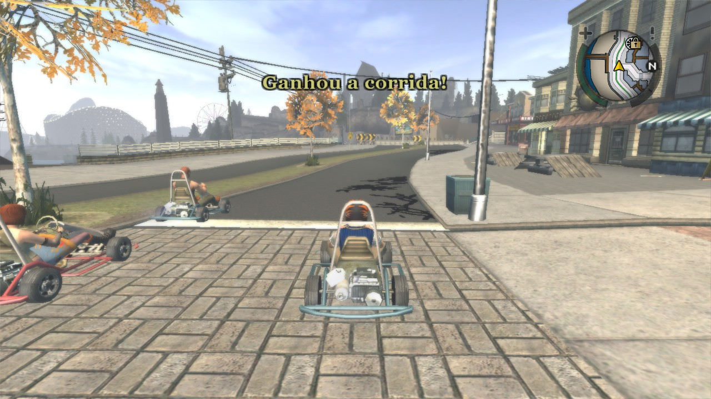
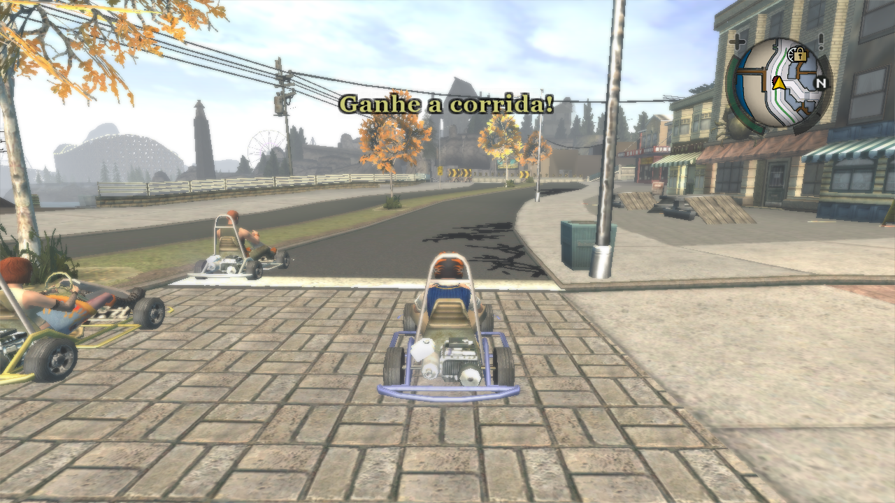

  
  <h1>Tradução PT-BR</h1>

O intuito deste projeto é pegar as traduções já feitas pela [GameVicio](https://www.gamevicio.com/traducao/traducao-de-bully-scholarship-edition-para-portugues-brasil/), [Tribo Gamer](https://tribogamer.com/traducoes/328_traducao-do-bully-scholarship-edition-para-portugues-do-brasil.html), e de usuários do [Forum MixMods](https://forum.mixmods.com.br/f109-outros/t2388-traducao-nova-para-bully-scholarship-edition), para fazer um revisão geral e diminuir ao máximo erros de ortografia e discordância na tradução como um todo, já que elas não recebem atualização a um bom tempo, assim formando uma tradução muito melhor!

> A corrida acabou de iniciar e aparece "Ganhou a corrida!"

> Resolvido ✨️🌟️💫️

## Instalação

Você pode baixar a tradução [aqui](https://github.com/cappp/bully-pt-br/archive/refs/heads/main.zip), extraia os arquivos da pasta `translation` do zip (o que está dentro dela) para a pasta do jogo, e substitua todos quando pedir, daí só jogar e se divertir. 😀️

**OBS:** A tradução foi testada na versão de PC do Bully na Steam e ainda não está totalmente completa! Veja as mudanças já feitas abaixo.

## Mudanças
Visite a [changelog.md](changelog.md) para ver todas as mudanças da tradução.
